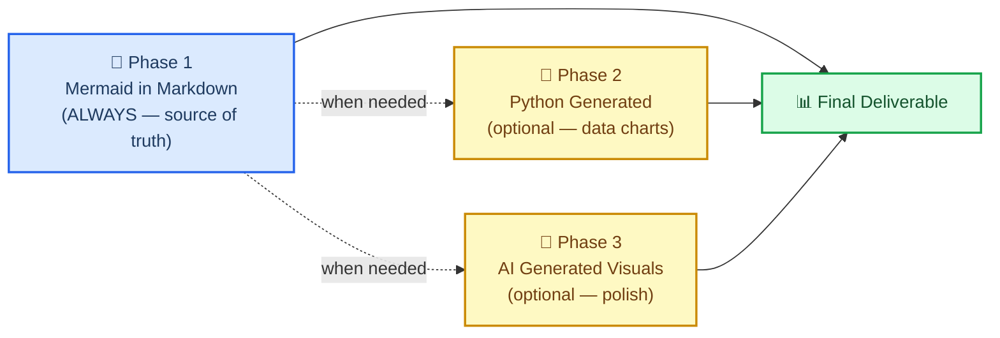
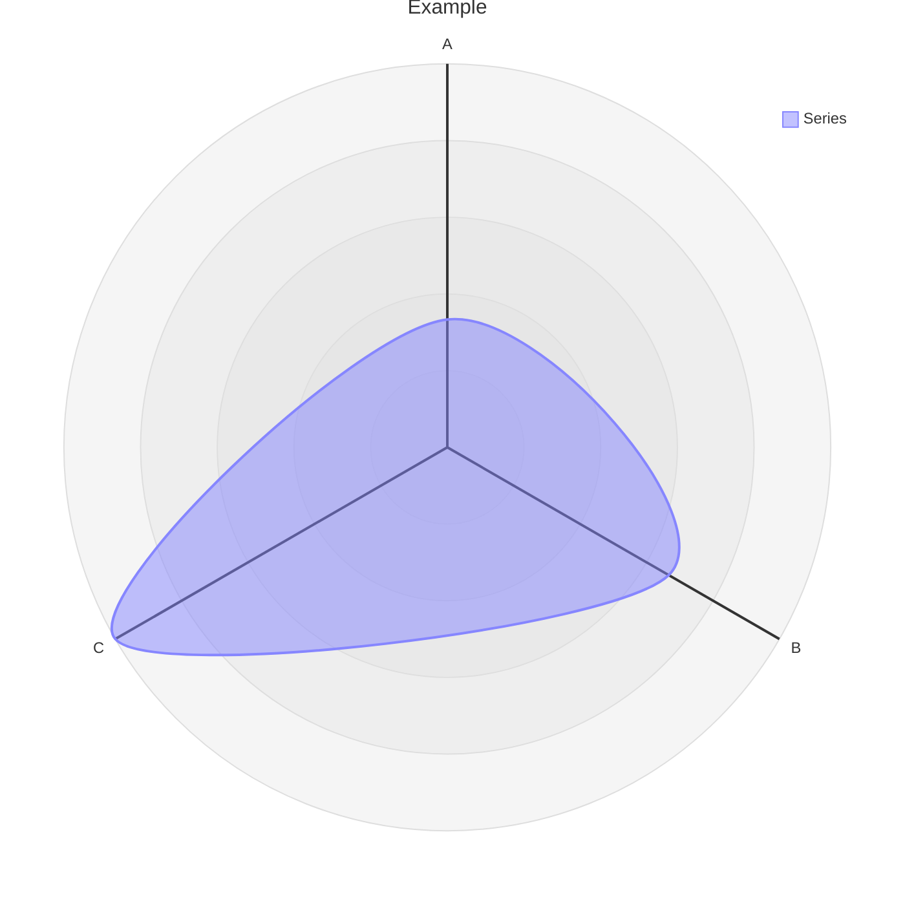

# Markdown and Mermaid Writing

## Overview

This skill teaches you — and enforces a standard for — creating scientific documentation
using **markdown with embedded Mermaid diagrams as the default and canonical format**.

The core bet: a relationship expressed as a Mermaid diagram inside a `.md` file is more
valuable than any image. It is text, so it diffs cleanly in git. It requires no build step.
It renders natively on GitHub, GitLab, Notion, VS Code, and any markdown viewer. It uses
fewer tokens than a prose description of the same relationship. And it can always be
converted to a polished image later — but the text version remains the source of truth.

> "The more you get your reports and files in .md in just regular text, which mermaid is
> as well as being a simple 'script language'. This just helps with any downstream rendering
> and especially AI generated images (using mermaid instead of just long form text to
> describe relationships < tokens). Additionally mermaid can render along with markdown for
> easy use almost anywhere by humans or AI."
>
> — Clayton Young (@borealBytes), K-Dense Discord, 2026-02-19

## When to Use This Skill

Use this skill when:

- Creating **any scientific document** — reports, analyses, manuscripts, methods sections
- Writing **any documentation** — READMEs, how-tos, decision records, project docs
- Producing **any diagram** — workflows, data pipelines, architectures, timelines, relationships
- Generating **any output that will be version-controlled** — if it's going into git, it should be markdown
- Working with **any other skill** — this skill defines the documentation layer that wraps every other output
- Someone asks you to "add a diagram" or "visualize the relationship" — Mermaid first, always
- Documenting **computational biology or bioinformatics projects** — scRNA-seq, bulk RNA-seq, spatial transcriptomics, metagenomics, or any iterative analysis workflow for a PI or collaborator

Do NOT start with Python matplotlib, seaborn, or AI image generation for structural or relational diagrams.
Those are Phase 2 and Phase 3 — only used when Mermaid cannot express what's needed (e.g., scatter plots with real data, photorealistic images).

## 🎨 The Source Format Philosophy

### Why text-based diagrams win

| What matters | Mermaid in Markdown | Python / AI Image |
| ----------------------------- | :-----------------: | :---------------: |
| Git diff readable | ✅ | ❌ binary blob |
| Editable without regenerating | ✅ | ❌ |
| Token efficient vs. prose | ✅ smaller | ❌ larger |
| Renders without a build step | ✅ | ❌ needs hosting |
| Parseable by AI without vision | ✅ | ❌ |
| Works in GitHub / GitLab / Notion | ✅ | ⚠️ if hosted |
| Accessible (screen readers) | ✅ accTitle/accDescr | ⚠️ needs alt text |
| Convertible to image later | ✅ anytime | — already image |

### The three-phase workflow



**Phase 1 is mandatory.** Even if you proceed to Phase 2 or 3, the Mermaid source stays committed.

### What Mermaid can express

Mermaid covers 24 diagram types. Almost every scientific relationship fits one:

| Use case | Diagram type | File |
| -------------------------------------------- | ---------------- | ---------------------------------------------------- |
| Experimental workflow / decision logic | Flowchart | `references/diagrams/flowchart.md` |
| Service interactions / API calls / messaging | Sequence | `references/diagrams/sequence.md` |
| Data model / schema | ER diagram | `references/diagrams/er.md` |
| State machine / lifecycle | State | `references/diagrams/state.md` |
| Project timeline / roadmap | Gantt | `references/diagrams/gantt.md` |
| Proportions / composition | Pie | `references/diagrams/pie.md` |
| System architecture (zoom levels) | C4 | `references/diagrams/c4.md` |
| Concept hierarchy / brainstorm | Mindmap | `references/diagrams/mindmap.md` |
| Chronological events / history | Timeline | `references/diagrams/timeline.md` |
| Class hierarchy / type relationships | Class | `references/diagrams/class.md` |
| User journey / satisfaction map | User Journey | `references/diagrams/user_journey.md` |
| Two-axis comparison / prioritization | Quadrant | `references/diagrams/quadrant.md` |
| Requirements traceability | Requirement | `references/diagrams/requirement.md` |
| Flow magnitude / resource distribution | Sankey | `references/diagrams/sankey.md` |
| Numeric trends / bar + line charts | XY Chart | `references/diagrams/xy_chart.md` |
| Component layout / spatial arrangement | Block | `references/diagrams/block.md` |
| Work item status / task columns | Kanban | `references/diagrams/kanban.md` |
| Cloud infrastructure / service topology | Architecture | `references/diagrams/architecture.md` |
| Multi-dimensional comparison / skills radar | Radar | `references/diagrams/radar.md` |
| Hierarchical proportions / budget | Treemap | `references/diagrams/treemap.md` |
| Binary protocol / data format | Packet | `references/diagrams/packet.md` |
| Git branching / merge strategy | Git Graph | `references/diagrams/git_graph.md` |
| Code-style sequence (programming syntax) | ZenUML | `references/diagrams/zenuml.md` |
| Multi-diagram composition patterns | Complex Examples | `references/diagrams/complex_examples.md` |

> 💡 **Pick the right type, not the easy one.** Don't default to flowcharts for everything.
> A timeline beats a flowchart for chronological events. A sequence beats a flowchart for
> service interactions. Scan the table and match.

---

## 🔧 Core workflow

### Step 1: Identify the document type

Check if a template exists before writing from scratch:

| Document type | Template |
| ------------------------------ | ----------------------------------------------- |
| Pull request record | `templates/pull_request.md` |
| Issue / bug / feature request | `templates/issue.md` |
| Sprint / project board | `templates/kanban.md` |
| Architecture decision (ADR) | `templates/decision_record.md` |
| Presentation / briefing | `templates/presentation.md` |
| Research paper / analysis | `templates/research_paper.md` |
| Project documentation (software) | `templates/project_documentation.md` |
| **Project documentation (compbio)** | **`templates/compbio_project_documentation.md`** |
| **Project documentation (compbio, interactive HTML)** | **`templates/compbio_project_documentation.html`** |
| How-to / tutorial | `templates/how_to_guide.md` |
| Status report | `templates/status_report.md` |

> 💡 **Choosing between project documentation templates:** Use `project_documentation.md` for software projects, R packages, APIs, and web applications. Use `compbio_project_documentation.md` for bioinformatics analysis projects (scRNA-seq, bulk RNA-seq, spatial transcriptomics, metagenomics, etc.) where the documentation serves as an analysis notebook recording iterative work performed for a PI or collaborator. The compbio template replaces software-centric sections (API Reference, Deployment, Quick Start) with analysis-centric sections (Script Reference, Manuscript/Data Submission, Experimental Design, Methods Comparison, Decision Log).

### Step 2: Read the style guide

Before writing any `.md` file: read `references/markdown_style_guide.md`.

Key rules to internalize:

- **One H1 per document** — the title. Never more.
- **Emoji on H2 headings only** — one emoji per H2, none in H3/H4
- **Cite everything** — every external claim gets a footnote `[^N]` with full URL
- **Bold sparingly** — max 2-3 bold terms per paragraph, never full sentences
- **Horizontal rule after every `</details>`** — mandatory
- **Tables over prose** for comparisons, configurations, structured data
- **Diagrams over walls of text** — if it describes flow, structure, or relationships, add Mermaid

### Step 3: Pick the diagram type and read its guide

Before creating any Mermaid diagram: read `references/mermaid_style_guide.md`.

Then open the specific type file (e.g., `references/diagrams/flowchart.md`) for the exemplar, tips, and copy-paste template.

Mandatory rules for every diagram:

```
accTitle: Short Name 3-8 Words
accDescr: One or two sentences explaining what this diagram shows.
```

- **No `%%{init}` directives** — breaks GitHub dark mode
- **No inline `style`** — use `classDef` only
- **One emoji per node max** — at the start of the label
- **`snake_case` node IDs** — match the label
- **`<br/>` for line breaks in labels** — never `\n` (renders as literal text in pandoc/Positron)

#### Mermaid diagram selection for computational biology

When documenting compbio projects, these diagram types are most commonly needed:

| What to diagram | Recommended type | Example |
| --- | --- | --- |
| Analysis pipeline / decision tree | Flowchart | QC --> clustering --> DE, with branch points where methods diverge |
| Project chronology / milestones | Timeline | Multi-month project with iterative PI feedback |
| Cell or read filtering cascade | Sankey | Cells entering QC steps, showing how many pass each filter |
| Analysis dependencies | Flowchart or Gantt | Which downstream analyses depend on which upstream objects |
| Methods comparison | Flowchart | Highlight selected method, gray out alternatives with `classDef` |
| Sample / batch relationships | ER diagram or Flowchart | Complex experimental designs with multiple batches or conditions |
| Parameter exploration | Quadrant | Comparing clustering resolutions or QC thresholds on two axes |

### Step 4: Choose output format

**Markdown (`.md`)** — the default. Use for all version-controlled documentation. Mermaid fenced blocks render natively on GitHub, GitLab, VS Code, and Positron. This is the source of truth.

**Self-contained HTML (`.html`)** — use when the user needs interactive Mermaid diagrams with zoom/pan, styled tables, dark/light theme support, or a polished presentation-ready page. The HTML template generates a single file with Mermaid loaded via CDN, zoom controls (+/−/reset, Ctrl/Cmd+scroll, drag-to-pan), and beautiful typography. No pandoc conversion needed — the HTML is written directly.

For compbio projects, both formats are available:
- `templates/compbio_project_documentation.md` — markdown source of truth
- `templates/compbio_project_documentation.html` — interactive HTML with zoomable Mermaid diagrams

When the user asks for HTML output or says diagrams aren't zoomable/interactive, use the HTML template. Read it before generating to absorb the patterns (theming, zoom controls, table styling, collapsible sections).

### Step 5: Write the document

Start from the template. Apply the markdown style guide. Place diagrams inline with related text — not in a separate "Figures" section.

### Step 6: Commit as text

The `.md` file with embedded Mermaid is what gets committed. If you also generated an HTML page or AI image, those are supplementary — the markdown is the source.

---

## ⚠️ Common pitfalls

### Radar chart syntax (`radar-beta`)

**WRONG:**
```mermaid
radar
title Example
x-axis ["A", "B", "C"]
"Series" : [1, 2, 3]
```

**CORRECT:**


- **Use `radar-beta`** not `radar` (the bare keyword doesn't exist)
- **Use `axis`** to define dimensions, **not** `x-axis`
- **Use `curve`** to define data series, **not** quoted labels with colon
- **No `accTitle`/`accDescr`** — radar-beta doesn't support accessibility annotations; always add a descriptive italic paragraph above the diagram

### XY Chart vs Radar confusion

| Diagram | Keyword | Axis syntax | Data syntax |
| ------- | ------- | ----------- | ----------- |
| **XY Chart** (bars/lines) | `xychart-beta` | `x-axis ["Label1", "Label2"]` | `bar [10, 20]` or `line [10, 20]` |
| **Radar** (spider/web) | `radar-beta` | `axis id["Label"]` | `curve id["Label"]{10, 20}` |

### Forgetting `accTitle`/`accDescr` on supported types

Only some diagram types support `accTitle`/`accDescr`. For those that don't, always place a descriptive italic paragraph directly above the code block:

> _Radar chart comparing three methods across five performance dimensions. Note: Radar charts do not support accTitle/accDescr._


---

## 🔗 Integration with other skills

### With `scientific-schematics`

`scientific-schematics` generates AI-powered publication-quality images (PNG). Use the Mermaid diagram as the **brief** for the schematic:

```
Workflow:
1. Create the concept as Mermaid in .md (this skill — Phase 1)
2. Describe the same concept to scientific-schematics for a polished PNG (Phase 3)
3. Commit both — the .md as source, the PNG as a supplementary figure
```

### With `scientific-writing`

When `scientific-writing` produces a manuscript, all diagrams and structural figures should use this skill's standards. The writing skill handles prose and citations; this skill handles visual structure.

```
Workflow:
1. Use scientific-writing to draft the manuscript
2. For every figure that shows a workflow, architecture, or relationship:
   - Replace placeholder with a Mermaid diagram following this skill's guide
3. Use scientific-schematics only for figures that truly need photorealistic/complex rendering
```

### With `literature-review`

Literature review produces summaries with lots of relationship data. Use this skill to:

- Create concept maps (Mindmap) of the literature landscape
- Show publication timelines (Timeline or Gantt)
- Compare methodologies (Quadrant or Radar)
- Diagram data flows described in papers (Sequence or Flowchart)

### With any skill that produces output documents

Before finalizing any document from any skill, apply this skill's checklist:

- [ ] Does the document use a template? If so, did I start from the right one?
- [ ] Are all diagrams in Mermaid with `accTitle` + `accDescr`?
- [ ] No `%%{init}`, no inline `style`, only `classDef`?
- [ ] Are all external claims cited with `[^N]`?
- [ ] One H1, emoji on H2 only?
- [ ] Horizontal rules after every `</details>`?

---

## 📚 Reference index

### Style guides

| Guide | Path | Lines | What it covers |
| ----------------------- | ------------------------------------------- | ----- | -------------------------------------------------- |
| Markdown Style Guide | `references/markdown_style_guide.md` | ~733 | Headings, formatting, citations, tables, Mermaid integration, templates, quality checklist |
| Mermaid Style Guide | `references/mermaid_style_guide.md` | ~458 | Accessibility, emoji set, color classes, theme neutrality, type selection, complexity tiers |

### Diagram type guides (24 types)

Each file contains: production-quality exemplar, tips specific to that type, and a copy-paste template.

`references/diagrams/` — architecture, block, c4, class, complex\_examples, er, flowchart, gantt, git\_graph, kanban, mindmap, packet, pie, quadrant, radar, requirement, sankey, sequence, state, timeline, treemap, user\_journey, xy\_chart, zenuml

### Document templates (10 types)

`templates/` — compbio\_project\_documentation, decision\_record, how\_to\_guide, issue, kanban, presentation, project\_documentation, pull\_request, research\_paper, status\_report

| Template | Use for |
| --- | --- |
| `compbio_project_documentation.md` | Bioinformatics analysis projects (scRNA-seq, RNA-seq, spatial, metagenomics) serving as analysis notebooks for PI-driven work |
| `compbio_project_documentation.html` | Same as above but as self-contained interactive HTML with zoomable Mermaid diagrams, styled tables, and dark/light theme |
| `project_documentation.md` | Software projects, R packages, APIs, web applications |
| `research_paper.md` | Data-driven analysis, literature reviews, methodology + findings |
| `decision_record.md` | Recording why a decision was made (ADR/RFC) |
| `how_to_guide.md` | Step-by-step instructions with prerequisites and troubleshooting |
| `status_report.md` | Progress updates, risk summaries, decisions needed |
| `presentation.md` | Slide-deck-style documents with speaker notes |
| `pull_request.md` | PR documentation with change inventory and review notes |
| `issue.md` | Bug reports and feature requests |
| `kanban.md` | Sprint/release/project work tracking |

### Examples

`assets/examples/example-research-report.md` — a complete scientific research report demonstrating proper heading hierarchy, multiple diagram types (flowchart, sequence, gantt), tables, footnote citations, collapsible sections, and all style guide rules applied.

---

## 📝 Attribution

All style guides, diagram type guides, and document templates in this skill are ported from the `SuperiorByteWorks-LLC/agent-project` repository under the Apache-2.0 License.

- **Source**: https://github.com/SuperiorByteWorks-LLC/agent-project
- **Author**: Clayton Young / Superior Byte Works, LLC (@borealBytes)
- **License**: Apache-2.0

This skill (as part of claude-scientific-skills) is distributed under the MIT License. The included Apache-2.0 content is compatible for downstream use with attribution retained, as preserved in the file headers throughout this skill.

---

[^1]: GitHub Blog. (2022). "Include diagrams in your Markdown files with Mermaid." https://github.blog/2022-02-14-include-diagrams-markdown-files-mermaid/

[^2]: Mermaid. "Mermaid Diagramming and Charting Tool." https://mermaid.js.org/
