<!-- Source: Adapted from https://github.com/SuperiorByteWorks-LLC/agent-project | Original License: Apache-2.0 | Original Author: Clayton Young / Superior Byte Works, LLC (Boreal Bytes) | Adapted for computational biology by Paul Cantalupo, University of Pittsburgh -->

# Computational Biology Project Documentation Template

> **Back to [Markdown Style Guide](../references/markdown_style_guide.md)** — Read the style guide first for formatting, citation, and emoji rules.

**Use this template for:** Bioinformatics and computational biology analysis projects including scRNA-seq, bulk RNA-seq, spatial transcriptomics (Visium, CosMx, GeoMx), metagenomics, ATAC-seq, multi-omics, or any project where iterative data analysis is performed for a PI or collaborator. Designed to serve as an **analysis notebook** that records what was run, why, what was decided, and where everything lives.

**Not for:** Software packages, R libraries, web applications, or APIs. Use the standard [project_documentation.md](project_documentation.md) template for those.

**Key differences from the software project template:**

| Software project template | This template |
| --- | --- |
| Quick Start / Install | Experimental design / Sample table |
| API Reference | Script reference with arguments and I/O |
| Configuration (env vars) | Analysis parameters (QC cutoffs, thresholds) |
| Deployment | Manuscript and data submission (GEO, SRA) |
| Contributing guidelines | Decision log (PI/analyst communication) |
| Single architecture | Methods comparison with selection rationale |

**Philosophy:** Compbio projects are not static software. They are iterative, spanning months or years, with analyses that branch, get deprecated, and evolve based on PI feedback and biological interpretation. The documentation must capture this history -- not just what the final analysis looks like, but how it got there and why alternatives were rejected. A colleague picking up this project should understand both the current state and the decision trail.

**Mermaid diagram guidance for compbio projects:**

| What to diagram | Recommended type | Notes |
| --- | --- | --- |
| Analysis workflow / decision tree | Flowchart | Show branching at decision points where analyst or PI chose a direction |
| Project chronology / milestones | Timeline | Critical for multi-month projects with iterative revisions |
| Cell/read filtering cascade | Sankey | Show how many cells/reads survive each QC step |
| Analysis dependencies | Flowchart or Gantt | Which analyses depend on which upstream objects |
| Methods comparison | Flowchart | Highlight the selected method, gray out alternatives |
| Sample/condition relationships | Flowchart or ER | Useful for complex experimental designs with batches |

---

## How to use

1. Copy this file as your project's `PROJECT_DOCUMENTATION_COMPBIO.md` or `README.md`
2. Replace all `[bracketed placeholders]` with your content
3. Delete sections that don't apply (e.g., External datasets if none were used)
4. Add Mermaid diagrams -- at minimum an architecture flowchart and a project timeline
5. Update the decision log as the project progresses; this is a living document
6. Keep the analysis parameters table current -- this is often the first thing a reviewer or collaborator checks

---

## The template

Everything below the line is the template. Copy from here:

---

# [Project Name]

_[One sentence: what organism, what technology, what biological question. Example: "Single-cell RNA-seq analysis of mouse periodontal tissue comparing control, disease, and resolution conditions."]_

---

## 📋 Table of contents

- [Project overview](#-project-overview)
- [Experimental design](#-experimental-design)
- [Data processing](#-data-processing)
- [Methods comparison](#-methods-comparison)
- [Primary analysis path](#-primary-analysis-path)
- [Downstream analyses](#-downstream-analyses)
- [External datasets](#-external-datasets)
- [Visualizations](#-visualizations)
- [Script reference](#-script-reference)
- [Key data objects](#-key-data-objects)
- [Output inventory](#-output-inventory)
- [Decision log](#-decision-log)
- [Manuscript and data submission](#-manuscript-and-data-submission)
- [Environment](#-environment)
- [Project timeline](#-project-timeline)
- [References](#-references)

---

## 📋 Project overview

[2-3 sentences describing the biological question, the approach, and the current status of the project (active, published, archived).]

### Key resources

| Resource | Location |
| --- | --- |
| PI / Collaborator | [Name, department, institution] |
| Analyst(s) | [Names] |
| Lab notebook / HackMD | [URL] |
| GitHub repository | [URL or "not tracked in git"] |
| Shared drive / OneDrive | [Path or URL] |
| Publication | [DOI or "in preparation" or "submitted"] |
| Data accession | [GEO/SRA/dbGaP ID or "not yet submitted"] |

---

## 🧬 Experimental design

[1-2 sentences describing the experimental design: what conditions are being compared and why.]

### Sample table

| Sample ID | Condition/Group | Replicate | Technology | Batch | Notes |
| --- | --- | --- | --- | --- | --- |
| [S1] | [Control] | 1 | [10X 3' v3] | [Batch1] | |
| [S2] | [Control] | 2 | [10X 3' v3] | [Batch1] | |
| [S3] | [Treatment] | 1 | [10X 3' v3] | [Batch2] | [e.g., low cell recovery] |

### Experimental conditions

| Group | Label | N | Description |
| --- | --- | --- | --- |
| [Control] | [C] | [3] | [Brief description of condition] |
| [Treatment] | [T] | [3] | [Brief description of condition] |

---

## ⚙️ Data processing

### Raw data source

| Item | Value |
| --- | --- |
| Sequencing platform | [e.g., Illumina NovaSeq 6000] |
| Chemistry / library prep | [e.g., 10X Chromium 3' v3 NextGem] |
| Raw data location | [e.g., HTC path, sequencing core delivery] |
| Processing pipeline | [e.g., CellRanger 7.1.0, STARsolo, nf-core/scrnaseq] |
| Genome / reference | [e.g., mm10, GRCh38, refdata-gex-mm10-2020-A] |
| Run by | [Name] |

### Analysis parameters

> 📌 **Keep this table current.** These are the parameters applied to the primary analysis. If different parameters were tested, document them in the [Methods comparison](#-methods-comparison) section.

| Parameter | Value | Script / step |
| --- | --- | --- |
| [Min cells per gene] | [3] | [seurat.R --mc 3] |
| [Min features per cell] | [300] | [seurat.R --minf 300] |
| [Min UMI per cell] | [1000] | [seurat.R --minumi 1000] |
| [Max UMI per cell] | [50000] | [seurat.R --maxumi 50000] |
| [Max mito %] | [10] | [seurat.R --maxmito 10] |
| [Clustering resolution] | [0.8] | [Seurat FindClusters] |
| [DE test] | [Wilcoxon] | [FindMarkers default] |
| [p-adj cutoff] | [0.05] | [Significance threshold] |
| [Log2FC cutoff] | [0.25 or 0.585] | [Specify per analysis] |

---

## 🔍 Methods comparison

[1-2 sentences explaining why multiple methods were evaluated. This section is critical for reproducibility -- it documents what was tried, what was selected, and why.]

| Method | Description | Run by | Outcome | Status |
| --- | --- | --- | --- | --- |
| [Method 1] | [Brief description] | [Name] | [Key finding or issue] | [Exploratory / Rejected / Selected] |
| [Method 2] | [Brief description] | [Name] | [Key finding or issue] | [Exploratory / Rejected / Selected] |
| **[Method N]** | **[Brief description]** | **[Name]** | **[Selected because...]** | **Primary** |

[Optional: Add a mermaid flowchart showing the methods as parallel paths converging on the selected approach.]

```mermaid
flowchart TB
    accTitle: Methods Comparison
    accDescr: [Description of the methods evaluated and which was selected]

    input[📦 Input Data] --> m1[Method 1\nBrief description]
    input --> m2[Method 2\nBrief description]
    input --> m3[Method N\nSelected approach]

    m3 --> downstream[Downstream Analyses]

    classDef primary fill:#dbeafe,stroke:#2563eb,stroke-width:2px,color:#1e3a5f
    classDef secondary fill:#f3f4f6,stroke:#9ca3af,stroke-width:1px,color:#374151

    class m3 primary
    class m1,m2 secondary
```



---

## 🔬 Primary analysis path

[Describe the selected analysis workflow in detail. This is the core of the documentation. Include the mermaid flowchart showing the complete analysis pipeline.]


### Annotation

[Describe the annotation strategy. For scRNA-seq, this typically involves automated tools and manual curation.]

| Step | Tool / method | Reference | Notes |
| --- | --- | --- | --- |
| [Automated prediction] | [e.g., SingleR, Azimuth, scType] | [Reference dataset used] | |
| [Manual curation] | [PI review] | [Spreadsheet or document reference] | [e.g., "PI provided labels in email 9/8/22"] |

### Key data objects

[Table of the primary data objects (RDS, h5ad, h5, etc.) that downstream analyses depend on. Include the metadata columns that were added.]

| File | Location | Description | Key metadata columns |
| --- | --- | --- | --- |
| [seurat.rds] | [path/to/rds/] | [Base object after clustering] | [orig.ident, RNA_snn_res.0.8] |
| [seurat_withPred.rds] | [path/to/rds/] | [Object with annotations] | [+ celltype, + pred] |

---

## 📊 Downstream analyses

[Organize sub-sections by analysis type. Include what script was run, what inputs/outputs, and any notable parameters or PI decisions.]

### Marker analysis

| Analysis | Idents / grouping | Parameters | Location |
| --- | --- | --- | --- |
| [Cluster markers] | [RNA_snn_res.0.8] | [Seurat defaults] | [path/to/markers/] |
| [Celltype markers] | [celltype column] | [Specific cutoffs] | [path/to/celltypes/] |
| [Differential markers] | [Group comparisons] | [Specific cutoffs] | [path/to/differential/] |

### Differential expression

| Analysis | Method | Grouping | Comparison | Location |
| --- | --- | --- | --- | --- |
| [Pseudobulk DE] | [EdgeR / DESeq2 / limma-voom] | [celltype] | [Condition A vs B] | [path/] |

### Functional annotation / enrichment

| Analysis | Tool | Input | Parameters | Location |
| --- | --- | --- | --- | --- |
| [Pathway enrichment] | [gProfiler / GSEA / EnrichR] | [Top N markers by avg_log2FC] | [Organism, gene sets] | [path/] |

### Cell-cell interaction

[If applicable. Document per-group and comparative analyses.]

### [Other analyses]

[Add sub-sections as needed: trajectory/pseudotime, differential abundance, subclustering, integration, etc.]

---

## 📚 External datasets

[If external published datasets were analyzed for comparison. Delete this section if not applicable.]

| Dataset | Accession | Publication | Purpose | Location |
| --- | --- | --- | --- | --- |
| [Author Year] | [GSE/SRA ID] | [DOI or PMID] | [Why this dataset was used] | [path/to/analysis/] |

---

## 🎨 Visualizations

[Document what was generated, for whom, and which versions are current. In multi-analyst projects, note who generated what.]

| Type | Description | Location | Generated by | Status |
| --- | --- | --- | --- | --- |
| [Heatmaps] | [Top 5 markers per cluster] | [path/to/plots/] | [Name] | [Current / Deprecated] |
| [Volcano plots] | [DvsC, RvsD with cutoffs] | [path/to/plots/] | [Name] | [Current] |
| [Box plots] | [Marker log ratios] | [path/to/plots/] | [Name] | [Current] |
| [UMAP plots] | [Group/cluster/celltype] | [path/to/plots/] | [Name] | [Current] |

### Filtering applied to visualizations

[Document any gene filtering applied to plots (e.g., ribosomal gene removal, mitochondrial gene exclusion) since this often differs from the DE analysis itself.]

---

## 🔧 Script reference

[Table of all analysis scripts with their purpose, key arguments, and expected inputs/outputs. This replaces the software template's API Reference.]

| Script | Purpose | Key arguments | Input | Output |
| --- | --- | --- | --- | --- |
| [seurat.R] | [Main Seurat pipeline] | [--samplesheet, --outdir, --removeCCassocgenes, QC params] | [Samplesheet + filtered matrices] | [seurat.rds, plots, QC reports] |
| [calculate_markers.R] | [Marker gene identification] | [--seuratrds, --idents, --globaldiff, cutoff params] | [seurat.rds] | [markers.xlsx, heatmaps] |

<details>
<summary><strong>📋 Deprecated scripts</strong></summary>

| Script | Replaced by | Notes |
| --- | --- | --- |
| [old_script.R] | [new_script.R] | [Why it was replaced] |

</details>

---

## 📦 Output inventory

### Directory structure

```
[project_name]/
├── [raw_data_dir]/          # [Pipeline output, not modified]
├── [analysis_dir]/
│   ├── [method_or_step]/
│   │   ├── rds/             # Serialized data objects
│   │   ├── plots/           # Generated figures
│   │   ├── outs/            # Tabular outputs (xlsx, csv, tsv)
│   │   ├── logs/            # Script logs and stdout captures
│   │   └── deprecated/      # Superseded analyses (keep for provenance)
│   └── scripts/             # Shared analysis scripts
├── [manuscript_dir]/        # Manuscript drafts and submission materials
├── doc/                     # PI-provided documents, spreadsheets
└── README.md / PROJECT_DOCUMENTATION.md
```

### File counts by type

| Type | Approximate count | Primary locations |
| --- | --- | --- |
| Excel (.xlsx) | [N] | [Directories] |
| Plot files (.png, .pdf) | [N] | [Directories] |
| Data objects (.rds, .h5ad, .h5) | [N] | [Directories] |
| HTML reports (.html) | [N] | [Directories] |
| Log files (.log, .out) | [N] | [Directories] |

---

## 📝 Decision log

> 📌 **This is a living section.** Update it as decisions are made throughout the project. Each entry should capture when, what was decided, by whom, and why. This is the institutional memory of the project.

| Date | Decision | Decided by | Context / rationale |
| --- | --- | --- | --- |
| [YYYY-MM-DD] | [What was decided] | [PI / Analyst / Meeting] | [Why, with reference to email or meeting if applicable] |
| [YYYY-MM-DD] | [What was deprecated] | [Who] | [Why the previous approach was abandoned] |

---

## 📤 Manuscript and data submission

[Delete this section if the project has not reached the manuscript stage.]

### Manuscript

| Item | Status | Location |
| --- | --- | --- |
| Draft version | [v1 / v2 / submitted / published] | [path or URL] |
| Supplementary tables | [Complete / In progress] | [path/] |
| Analyst contributions | [What sections or figures the analyst contributed] | |

### Data submission

| Repository | Accession | Status | Embargo |
| --- | --- | --- | --- |
| [GEO] | [GSE number] | [Private / Public] | [Date or "released"] |
| [SRA] | [SRP number] | [Private / Public] | [Date] |
| [dbGaP] | [phs number] | [Controlled access] | |

---

## 💻 Environment

[Document the computational environment so the analysis can be reproduced.]

| Item | Value |
| --- | --- |
| R version | [e.g., 4.3.1] |
| Seurat version | [e.g., 4.4.0] |
| Bioconductor version | [e.g., 3.18] |
| renv.lock | [path/to/renv.lock or "not used"] |
| sessionInfo | [path/to/sessionInfo.txt or "not captured"] |
| Compute environment | [e.g., local Mac, HTC cluster, AWS] |
| Pipeline version | [e.g., CellRanger 7.1.0] |

### Key package versions

[List only the packages critical to reproducing key results. Do not list every installed package.]

| Package | Version | Used for |
| --- | --- | --- |
| [Seurat] | [4.4.0] | [Clustering, DE, visualization] |
| [SingleR] | [2.4.0] | [Automated annotation] |
| [CellChat] | [1.6.1] | [Cell-cell interaction] |
| [edgeR] | [3.42.4] | [Pseudobulk DE] |

---

## 📅 Project timeline


---

## 🔗 References

[Footnote citations for tools, methods, and external resources used in the project.]

[^1]: [Tool/method]. [URL]
[^2]: [Dataset]. [URL]

---

_Last updated: [Date] · Analyst: [Name] · Institution: [Institution]_
